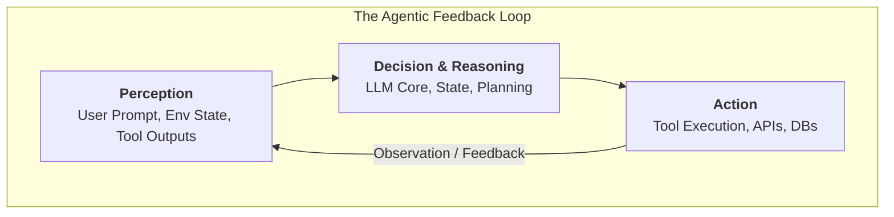

# Day 01: Introduction to AI Agents and Autonomous Systems

> **Date:** August 17, 2026  
> **Track:** AI Agents & Autonomous Systems  
> **Phase:** 1 (Foundations & Core Concepts — Days 1–5)  
> **Status:** ✅ Completed

---

## 📌 Executive Summary: What is an AI Agent?

In modern software engineering, it is crucial to delineate the architectural boundaries between deterministic code, single-turn LLM completions, and autonomous agent loops.

1. **Deterministic Software:** 
   Executes rigid, hard-coded rules ($X \rightarrow Y$) with standard control flow (`if/else`, `switch`, loops). Cannot adapt dynamically to open-ended, unstructured real-world ambiguity.
2. **Vanilla LLM (Single-Turn Completion):** 
   A stateless statistical model. Given an input prompt, it predicts the next most probable sequence of tokens and halts. It possesses no inherent environmental awareness, cannot invoke external tools autonomously, and retains no state across executions.
3. **AI Agent (Autonomous System):** 
   An entity designed around a goal-driven loop that continuously observes its environment (**Perception**), reasons through multi-step plans (**Decision / Reasoning**), triggers real-world side effects through APIs or tools (**Action**), and consumes execution outcomes to self-correct (**Feedback Loop**).



---

## 🏛️ Russell & Norvig Taxonomy: Agent Classifications

Understanding the foundational classifications of intelligent agents provides a structured mental model for architecting complex LLM systems:

| Agent Type | Fundamental Mechanism | Modern LLM / Cloud Native Equivalent |
| :--- | :--- | :--- |
| **Simple Reflex Agent** | Evaluates immediate condition-action rules (`if condition then action`). Retains no history. | Rule-based triage engines, stateless webhooks, regex-triggered tool invocations. |
| **Model-Based Agent** | Maintains an internal model of the world state across time. | Session memory, chat histories, short-term state stores (e.g., Redis session state). |
| **Goal-Based Agent** | Evaluates candidate actions against their ability to reach a specified destination state. | Multi-step task decomposition, ReAct (Reason + Act) loops, Chain-of-Thought planning. |
| **Utility-Based Agent** | Optimizes for a quantified performance trade-off function ($\text{Utility} = f(\text{Cost}, \text{Latency}, \text{Quality})$). | Dynamic model routing (e.g., routing simple queries to small SLMs and complex reasoning to larger LLMs), cost & latency optimizers. |
| **Learning Agent** | Continuously improves decision policies based on feedback and operational telemetry. | Reflection loops, self-correction on tool errors, reinforcement learning with human feedback (RLHF/DPO). |

---

## 🔬 Interactive Scenario & Architecture Checkpoints

During Day 01's deep dive, we analyzed two enterprise-grade scenarios to dissect agent composition and security postures.

### Scenario 1: Multi-Agent E-Commerce Support Assistant

#### 📋 Challenge Context:
Consider an autonomous e-commerce customer support assistant with the following behaviors:
1. Accepts an order ID from the user and queries the shipping carrier's REST API.
2. If the package is delayed, it apologizes and automatically provisions a $5 coupon code.
3. Retains customer complaints and context throughout the multi-turn session.
4. Dynamically routes queries to minimize LLM token costs and response latency.

#### 💡 Staff Engineer Breakdown:
* **Simple Reflex Layer:** The deterministic rule *"If shipping_status == DELAYED $\rightarrow$ trigger `issue_coupon($5)`"*.
* **Model-Based Layer:** The conversational memory layer maintaining order context, customer sentiment, and past interactions.
* **Goal-Based Layer:** The objective to resolve customer inquiries and successfully close support tickets.
* **Utility-Based Layer:** The intelligent model router optimizing the trade-off between API latency, token consumption, and response accuracy.

---

### Scenario 2: Autonomous GitHub Issue-Fixing Engineer

#### 📋 Challenge Context:
Architect an autonomous agent tasked with triaging, diagnosing, and fixing GitHub issues across a production repository.

#### 💡 Architecture Blueprint:
1. **Perception Engine (Sensors / Ingestion):**
   * GitHub Webhooks & Issue payload (title, description, stack trace, labels).
   * File system indexing & AST search to inspect the target codebase.
   * CI/CD build outputs, failing test logs, and terminal stderr.
2. **Action Engine (Actuators / Tooling):**
   * **Code Modification Tool:** AST-aware file editing, diff application, syntax validation.
   * **Execution & Git Tool:** Terminal runner to execute `npm test` / `pytest`, stage commits, and open Pull Requests.

---

## 🛡️ Production & Security Lens (Staff Engineer Principles)

Deploying autonomous agents into production environments requires strict adherence to defensive engineering principles:

```
┌────────────────────────────────────────────────────────────────────────────┐
│                       SECURITY & SAFETY GUARDRAILS                        │
├─────────────────────────┬─────────────────────────┬────────────────────────┤
│     Least Privilege     │   Blast Radius Control  │  Human-in-the-Loop     │
│ • No raw .env access    │ • Read-Only vs Mutating │ • Mandatory approval   │
│ • Isolated tokens       │ • Sandboxed containers  │   for DELETE / deploy  │
│ • Narrow tool scopes    │ • Circuit breakers      │ • Structured diffs     │
└─────────────────────────┴─────────────────────────┴────────────────────────┘
```

1. **Principle of Least Privilege (PoLP):**
   * Never grant agents indiscriminate access to environment configurations (`.env`), root API keys, or unrestricted database credentials.
   * Restrict access exclusively to isolated, ephemeral tokens scoped to the exact task.
2. **Blast Radius Isolation:**
   * Segregate tools into **Safe / Idempotent** (e.g., `read_file`, `search_code`, `get_issue`) versus **Destructive / Mutating** (e.g., `delete_branch`, `drop_table`, `force_push`).
   * Execute untrusted code generation inside isolated container sandboxes (e.g., gVisor, Docker scratch environments).
3. **Human-in-the-Loop (HITL) for Irreversible Operations:**
   * Critical side-effects (e.g., merging code to `main`, executing production migrations, processing financial transactions) must yield execution and wait for human confirmation.
4. **Execution Boundaries & Circuit Breakers:**
   * Guard against infinite recursive loops and token runaway by enforcing hard thresholds on `max_iterations = 10` and global request timeouts.

---

## 💡 Vocabulary & Technical Reference

* **AI Agent:** An autonomous software entity that perceives its environment through sensors/APIs, reasons through an LLM core, and acts via actuators/tools to achieve predefined goals.
* **Autonomous System:** A software architecture capable of self-directed decision-making and operational execution without manual step-by-step human intervention.
* **LLM (Large Language Model):** The central reasoning and natural language processing engine powering the agent's cognitive capabilities.
* **Perception-Action Loop:** The cyclical flow of ingesting observations, synthesizing decisions, executing actions, and ingesting the resulting state changes.
* **Tool Calling / Function Calling:** Structured protocols (e.g., JSON Schema / MCP) allowing LLMs to emit parseable instructions for external execution.

---

## 🏁 Day 01 Verification & Definition of Done

- [x] **Conceptual Foundations:** Defined the distinctions between deterministic code, LLMs, and autonomous agents.
- [x] **Taxonomy Mastery:** Mapped the 5 classic agent models (Russell & Norvig) to contemporary AI engineering patterns.
- [x] **Architecture Loop:** Documented the `Perception → Decision → Action` loop with Mermaid visual models.
- [x] **Defensive Engineering:** Formulated security guardrails (Least Privilege, HITL, Sandboxing, Circuit Breakers).
- [x] **Public Progress Dashboard:** Created and synced [PROGRESS.md](../../PROGRESS.md).

---

## 🚀 Up Next

* [ ] **[Day 02: Understanding the Agentic Mindset: LLMs, Tools, and Memory](./day-02.md)**
